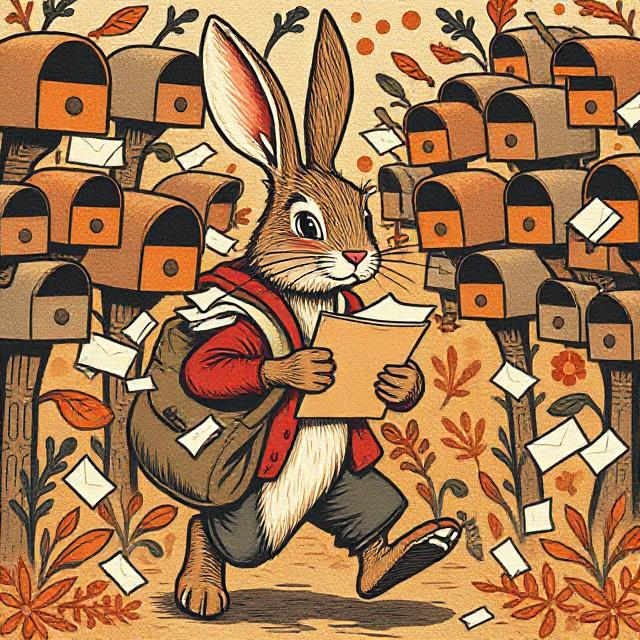
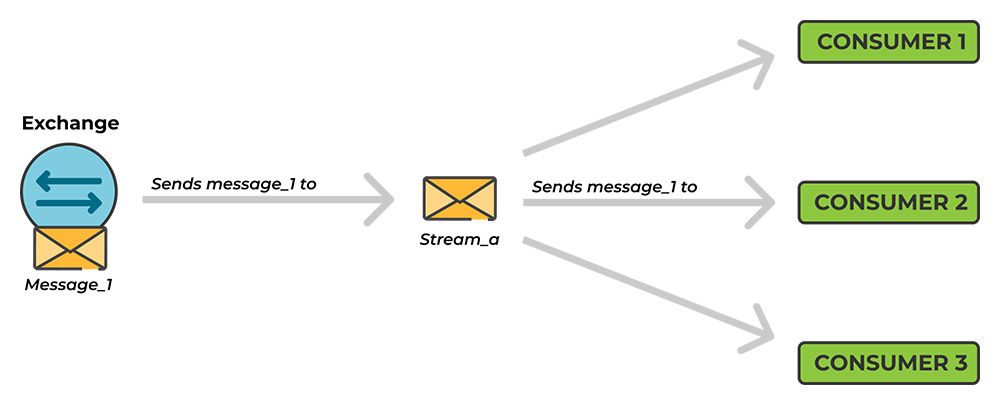
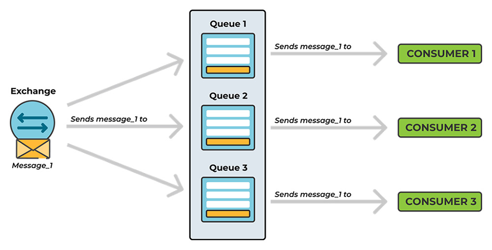

# AMQP and RabbitMQ Glossary 📚

This glossary provides definitions for key AMQP concepts. It is focused on RabbitMQ perspective and usage, since it's the most widely used tool for AMQP.



## A

### AMQP
Advanced Message Queuing Protocol, messaging protocol for sending and receiving messages between messaging systems.

<details>
<summary>Detailed Explanation</summary>
AMQP is a binary protocol, suitable for large amounts of data. It is optimized for machine efficiency and speed instead of human readability.

AMQP is an application layer protocol that focuses on process-to-process communication across IP networks. An encoding schema and a set of procedures allow for two different servers to communicate regardless of the technology used.

Overall, the goal of AMQP is to enable message passing through broker services over TCP/IP connections. AMQP is considered a compact protocol since it’s binary. Meaning that everything sent over AMQP is binary data.

</details>

**Tips:**
- Don't even think about it with monoliths
- In terms of storage, it's just temporary, don't treat it like a storage system for messages
- For non-async communication API will usually be a better choice

**When to use:**
- With microservices
- When scalability is important
- Fault tolerance is a focus
- Async communication

### Ack (acknowledgement)
A message is considered acknowledged when it has been processed by the consumer. "Acking" is a way to confirm that a message has been received and processed correctly.

<details>
<summary> Detailed Explanation</summary>
Messages in transit might get lost in the event of a connection failure and need to be retransmitted
***Ack*nowledgments** let the server and clients know when to **retransmit** messages. The **client** can either **ack** the message when it receives it, or when the client has completely processed the message. Publish confirm is the same concept but for publishing. The server confirms when it has received a message from a publisher.

A **message** can be considered successfully delivered either immediately once it is sent out, once it’s written to a TCP socket, OR when an **explicit** **acknowledgment** is received from the **client**. The first option is called a **Publisher Confirm** 

The manually sent **acknowledgment** can be positive or negative.

Once an acknowledgment is received, the message can be discarded from the queue. If the consumer cannot process a message, the desired outcome could be to requeue it and let another consumer receive and handle it, or to retry processing at a later time. Such deliveries can be discarded by the broker or requeued.

If for some reason, the consumer cannot process a message, the use of consumer acknowledgement can prevent a message loss by letting another available consumer receive and handle it, or retrying the process at a later time.

#### Manual and Automatic

Manual Acks are the default setting for consumer acknowledgements in RabbitMQ.

Automatic Acknowledgement - Acks are received once the message is sent out and written to a TCP socket. RabbitMQ considers the message to be successfully sent once it has left the broker.

Notice that Automatic Acknowledgement should be considered unsafe, as an unexpected message loss in case of connection failure to the consumer might result in a message being dropped after leaving RabbitMQ. Because of this, this setup is not suitable for all workloads.
</details>

### Alternate Exchange
A backup for unroutable messages

<details>
<summary> Detailed Explanation</summary>
Unroutable messages are an issue. They slow down processing times if applications make multiple attempts at delivery or are kept busy by continually logging them. Additionally, there is the problem of what to do with unrouted messages, which must eventually be handled or dropped.
Whether messages return or not, unroutable messages can:
- Be returned to a broken application that constantly resends them
- Be the result of malicious activity aimed at causing RabbitMQ to become unresponsive
- Cause the loss of mission-critical data

unroutable messages can be a result of:
- A bug in the application
- non-existent routing keys
- malformed messages
- etc.

#### What Happens to Unroutable Messages in RabbitMQ?

It is possible to avoid the complete loss of a message. RabbitMQ handles unroutable messages in two ways based on the mandatory flag within the message header. The server either returns the message when the flag is set to true or silently drops the message when set to false.

Applications can log returned messages, but logging does not provide a mechanism for dealing with an unreachable exchange or queue.
</details>

## B

### Broker
Software serving as a middleman for services using messaging, receiving messages from one service (Producers) and handing them over to others (Consumers) to complete the task.

<details>
<summary> Detailed Explanation</summary>
RabbitMQ is a message broker.

Message Broker can try to deliver a message until consumer consumes correctly. A message is safe within the broker, only gets deleted when it has been delivered and acknowledged as such. The risk of loosing a message is minimal, much lower when using the same logic with APIs.
</details>

### Binding
A binding is a mechanism that allows to send messages to a queue based on some routing key, an association, or relation between a queue and an exchange.
It describes which queue is interested in messages from a given exchange

<details>
<summary> Detailed Explanation</summary>
Bindings can take an extra parameter called routing_key.
</details>

### C

### Channel

A "light" version of connection, which can be used to send and receive messages, a way to keep reusing the same connection.

<details>
<summary> Detailed Explanation</summary>
Every AMQP protocol-related operation occurs over a Channel.
</details>

### Client

A user of a messaging system in the form of software that sends and receives messages.

<details>
<summary> Detailed Explanation</summary>
Clients send messages through the channel’s "basic_publish" method.
</details>

### Cluster

A group of brokers that work together to provide a single messaging service.

<details>
<summary> Detailed Explanation</summary>
A RabbitMQ cluster is a group of one or several RabbitMQ servers, where each RabbitMQ server is sharing users, virtual hosts, queues, exchanges, bindings, runtime parameters, and other distributed states. When setting up a cluster, you set up another RabbitMQ node and join that node into the default node.
</details>

### Connection

A link between a client and a broker.

<details>
<summary> Detailed Explanation</summary>
It performs underlying networking tasks. These tasks include initial authentication, IP resolution, and networking. RabbitMQ supports both IPv4 and IPv6 connections and in general handles all the complicated stuff connected to networking.

A connection can multiplex into several “light-weight connections”. This "lightweight connection" is called a Channel.

A connection is created by opening a physical TCP connection to the target server.
</details>

## D

### Dead Lettering

Allows orphaned messages to be stored and processed

<details>
<summary> Detailed Explanation</summary>
Some messages become undeliverable or unhandled even when received by the broker. This can happen when the amount of time the message has spent in a queue exceeds the time to live, TTL, when the queue reaches its capacity, or when a message is negatively acknowledged by the consumer. Such a message is called a dead message.

Dead letter handling is a key part of almost any messaging system.

#### When is a message dead?
- A message is negatively acknowledged by the consumer
- The TTL of a message expires
- The queue reaches capacity

By default, the broker drops these messages. Publishing is successful, however, the RabbitMQ consumer never handles or has a chance to handle the message successfully.

_Please note that messages that are dropped by the exchange or messages that are not routed need to be handled by the alternate exchange._

#### When use it?
- When you know that you have messages that might be nacked, but still need to be handled.
- When you can’t lose messages with an expiring TTL
- When the queue might reach TTL capacity

</details>

## E

### Exchange

An exchange is a point of communication between producers and consumers. First entry point for a message entering the message broker.

<details>
<summary> Detailed Explanation</summary>
Producer sends messages to an exchange, which you can think of as a message routing agent.

An exchange is responsible for routing messages to different queues with the help of header attributes, bindings, and routing keys.

It has four types:

- Direct
  - Directs by exchange to specific queue by looking at routing key. The routing key in the message is compared for equality with routing keys on bindings.
- Topic
  - To one or many queue from exchange, by looking at routing key in a more general way, with key-patterns on the bindings. The routing key must be a list of words delimited by a period. The topic exchange supports "strict" routing key-matching, like a direct exchange, but will also perform "wildcard" matching using star (*) and hash (#) as placeholders.
- Fanout
  - Copies and routes a received message to all queues that are bound to it regardless of routing keys. A provided routing key is simply ignored.
- Headers
  - Headers exchanges are very similar to topic exchanges but route messages based on the header values instead of routing keys. A special argument named "x-match" added in the binding between exchange and queue, specifies if headers must match "all" or "any".
</details>

## F

### Fan-out architecture

Multiple consumers read the same message. Implementing this sort of architecture with queues isn’t optimal. 

<details>
<summary> Detailed Explanation</summary>
Having to add queues for every added consumer is resource intensive, which gets worse when dealing with queues that need to persist data.

For fan-out architecture, stream based approach is recommended. Because consumers read messages from a Stream in a non-destructive manner, a message will always be there for the next consumer to access it. In essence, to implement a fan-out architecture, just declare a RabbitMQ Stream and bind as many consumers as needed.

Comparison of fan-out using streams and queues:


</details>

## L

### Lazy Queue
**Highly version dependent concept. Seems to have been introduced in 3.6, but removed in 4.0 version of rabbitmq**

A policy that tells the queue to store messages to disk instead of RAM

<details>
<summary> Detailed Explanation</summary>
Queues can become long for various reasons including consumer maintenance or the arrival of large batches of messages. While RabbitMQ can support millions of messages, keeping queues as short as possible is recommended by most experts. Messages are stored in memory by default. RabbitMQ then flushes messages (page out) to free up the RAM usage when the queue becomes too long for the underlying instance to handle. Storing messages in RAM enables faster delivery of messages to consumers than storing them to disk.

The page out function usually takes time and often stops the queue from processing messages, which deteriorates the queue speed. For this reason, queues that contain a lot of messages can have a negative impact on the broker's performance. Additionally, it takes a lot of time to rebuild the index after a cluster is restarted and to sync messages between Nodes.
</details>

## M

### Message

A message is a unit of data that is sent from a producer.

<details>
<summary> Detailed Explanation</summary>

</details>

### Message Queue

A queue is a list of messages that are waiting to be processed. Same as queue, but this naming is often used in RabbitMQ.

### Microservice

A microservice is a small piece of software that is responsible for a specific task. It is often a single service that is self-contained and can be deployed independently of other services.

## P

## Prefetch

The prefetch count is the number of messages that will be sent to a consumer at a time. How many messages are being sent at the same time.

<details>
<summary> Detailed Explanation</summary>
Messages in RabbitMQ are pushed from the broker to the consumers. The RabbitMQ default prefetch setting gives clients an unlimited buffer, meaning that RabbitMQ, by default, sends as many messages as it can to any consumer that appears ready to accept them. It is, therefore, possible to have more than one message "in-flight" on a channel at any given moment.

Messages are cached by the RabbitMQ client library (in the consumer) until processed. All pre-fetched messages are invisible to other consumers and are listed as unacked messages in the RabbitMQ management interface.

Prefetching in RabbitMQ simply allows you to set a limit of the number of unacked (not handled) messages.
</details>

### Properties

Properties can be defined for Queues, Exchanges, and Messages in RabbitMQ. Some are mandatory, some optional. They are used to define behaviour.

<details>
<summary> Detailed Explanation</summary>
Defined by AMQP protocol, implemented by RabbitMQ for us.  An example of a property for a queue is “passive”, “durable” and “exclusive”.

A property can be set while creating the queue, code-wise, via the management interface, or via policies.

```ruby
channel.queue_declare(queue: 'test', durable: true)
```
</details>

### Poison message

Message that is not consumed completely or positively acknowledged, or whatever reason, your consumer cannot process that message.

<details>
<summary> Detailed Explanation</summary>
Those messages will/can cause a consumer to repeatedly requeue a delivery. quorum queue is one possible way to handle those
</details>

### Policies

Policies make it possible to configure arguments for one or many queues at once, and the queues will all be updated when you’re updating the policy definition.

<details>
<summary> Detailed Explanation</summary>
The use of policies allows reduce the overhead work of configuring every single queue and exchange with arguments.

Policies are created per vhost, with a pattern that defines where it will be applied and a parameter that defines what the policy will do.

Policies can be changed at any time, and changes will affect all matching queues and exchanges.

A policy is applied when the pattern, a regular expression, matches a queue or exchange.
</details>

## Q

### QoS Prefetch

The QoS (Quality of Service) prefetch option specifies the number of unacknowledged messages that the broker will send to a consumer at a time.

In other words: a setting that specifies the maximum number of “in-progress” messages that a specific consumer could accommodate at a time.

<details>
<summary> Detailed Explanation</summary>
Let’s take the case of a consumer whose QoS prefetch is set to 3. Imagine this consumer currently having 3 “in-progress” messages(the currently executing message not included): **message-1** , **message-2** , and **message-3** .

Because this consumer’s QoS prefetch is set to 3 and it already has 3 “in-progress” messages, RabbitMQ will not push a fourth message, message-4 , until one of the “in-progress” messages has been resolved. RabbitMQ implements this check to ensure that consumers are not overwhelmed with messages.
</details>

### Queue
A queue is a list of messages that are waiting to be processed.

<details>
<summary> Detailed Explanation</summary>
It's a first-in-first-out (FIFO) data structure.

Messages are not published directly to a queue.

The **queue** is the place where **messages** are stored until they are consumed by the **consumer**, or in other ways removed from the **queue**. **Queues** have properties that define how they behave, and these properties are passed to the broker when the queue is declared.

- A queue has some required properties and some optional.
- A queue always has a name, so that services can reference them.
  - A queue declared with no name, is given a random name by most client libraries.
- A queue can be marked as durable, which specifies if the queue should survive a broker restart.
- A queue can be exclusive, which specifies if the queue can be used by only one connection. An exclusive queue is deleted when that connection closes.
- A queue can also be declared with the auto-delete property, meaning that a queue that has had at least one consumer is deleted when the last consumer unsubscribes.
- There are also some optional properties used by plugins and broker-specific features, like TTL, which is telling an unused queue when to expire after a period of time.

Before a queue can be used it has to be declared. Declaring a queue will cause it to be created if it does not already exist.

#### Life-cycle for a temporary message queue.

1. The client creates the message queue (Declare). The server confirms (Declare-Ok).
2. The client starts a consumer on the message queue.
3. The client cancels the consumer, either explicitly or by closing the channel and/or connection.
4. When the last consumer disappears from the message queue, the server deletes the message queue.
</details>

## R

### Requeue

A message is requeued when it fails to be delivered to a consumer.

<details>
<summary> Detailed Explanation</summary>
A requeued message is placed back into its original position in its queue, if possible, and can therefore immediately be ready for redelivery. If all consumers requeue because they cannot process a delivery, they create a requeue/redelivery loop. It is possible to track the number of redeliveries and reject messages for good (discard them) or schedule a requeue after a delay.
</details>

### Routing Key
The routing key is a string that is used to determine which queue a message should be sent to. Attached to a binding, can also be send with a message.

<details>
<summary> Detailed Explanation</summary>
The routing key on the binding is sometimes called a binding key, and the routing key in the message are the things the exchange is looking at while delivering messages.
</details>

## S

### Stream

Functionality consisting of stream queues and protocols. A stream queue is persistent and replicated, differs from regular queue because it does not remove messages after they have been consumed, allowing for repeated consumption. 

<details>
<summary> Detailed Explanation</summary>
Stream queues can be used with traditional AMQP clients, i.e. they don’t have to use the stream protocol.
Similar to functionalities that can be found in Apache Kafka.
RabbitMQ Streams also comes with its very own stream protocol, which has shown to be much faster than AMQP in RabbitMQ.

#### Benefits of Using RabbitMQ Streams
- Large number of consumers can easily consume the same message.
- Messages can be consumed multiple times.
- Messages will stay in queues until they are expired with retention policies.
- High throughput when using the stream protocol.
- Streams can easily store millions of messages without issues (which is not always the case with traditional queue-type messages in RabbitMQ). Alternative to Apache Kafka.

**Tips:**
- Dramatic change from queues
- Used to complement queues, not replace them


**When to use:**
You see one of those problems with your queues:
- They deliver the same message to multiple consumers by binding a dedicated queue for each consumer. This can lead to scalability problems
- Erasing read messages and making it impossible to re-read(replay) them or grab a specific message in the queue is a problem.
- You are handling millions of messages (queues are optimized to gravitate toward an empty state).
- Fan-out architectures: Where many consumers need to read the same message
- Replay & time-travel: Where consumers need to read and reread a message from any point in the stream.
- Large Volumes of Messages: Streams are great for use cases where large volumes of messages need to be persisted.
- High Throughput: RabbitMQ Streams process relatively higher volumes of messages per second.
</details>

## V

### Virtual Hosts

A virtual host is a logical grouping of queues, exchanges, bindings, and other objects. It is used to logically separate resources and to provide isolation from other virtual hosts.

<details>
<summary> Detailed Explanation</summary>
Virtual hosts (or vhosts) in RabbitMQ provide a way to segregate applications using the same RabbitMQ instance. RabbitMQ vhosts create a logical group of connections, exchanges, queues, bindings, user permissions, etc. within an instance.

Think of vhosts as individual, uniquely named containers. Inside each vhost container is a logical group of exchanges, connections, queues, bindings, user permissions, and other system resources.
</details>
